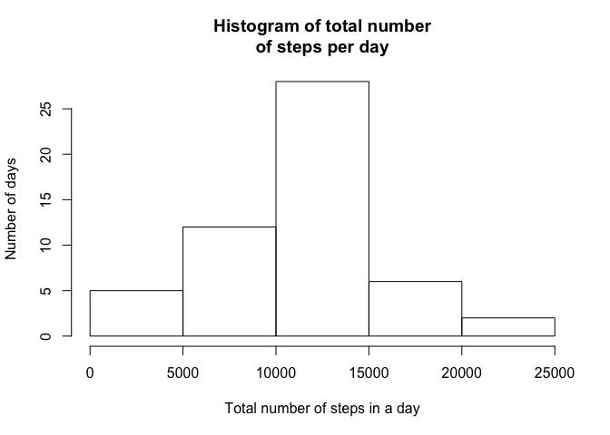
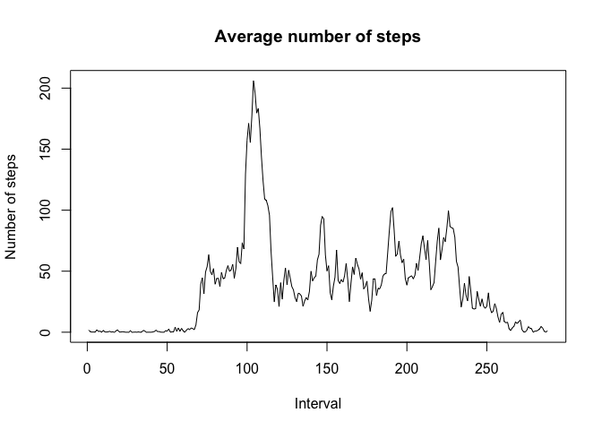
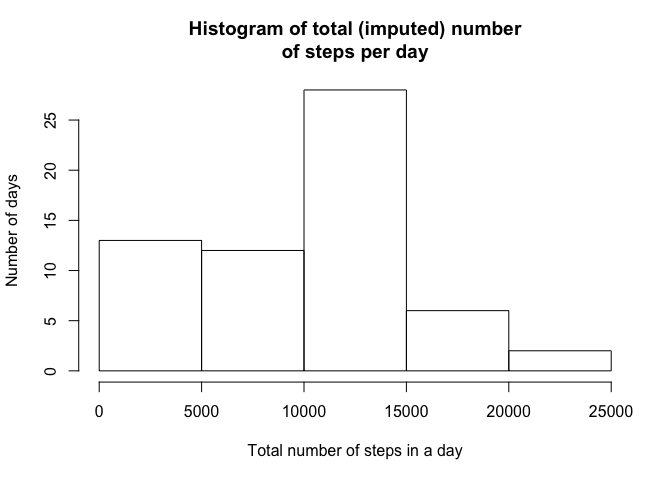
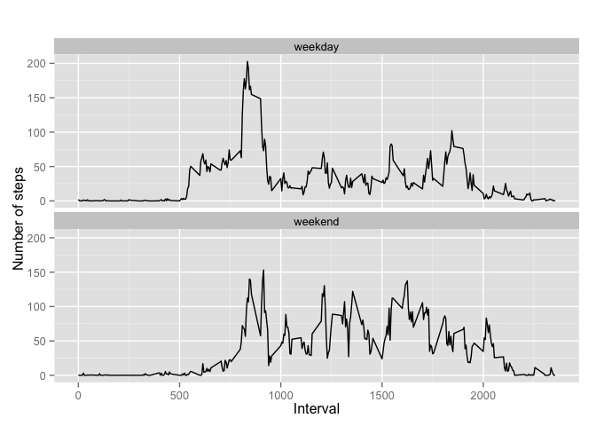

# Reproducible Research Peer Assessment 1

## Loading and preprocessing the data

Show any code that is needed to

1. Load the data (i.e. read.csv())


```r
# Conditionally download and unzip the data file required
if(!file.exists("activity.zip")) {
    download.file("https://d396qusza40orc.cloudfront.net/repdata%2Fdata%2Factivity.zip","activity.zip", "curl")
}
if(!file.exists("activity.csv")) {
    unzip("activity.zip")
}
##Load the data (i.e. read.csv())
activity<-read.csv("activity.csv")
```

2. Process/transform the data (if necessary) into a format suitable for your analysis

## What is mean total number of steps taken per day?

For this part of the assignment, you can ignore the missing values in the dataset.


```r
##Process/transform the data (if necessary) into a format suitable for your analysis
###Use aggragate to sum over the number of steps for each date, omitting incomplete observations
stepsbydate <- aggregate(steps ~ date, na.omit(activity), sum)
```

1. Make a histogram of the total number of steps taken each day


```r
##Make a histogram of the total number of steps taken each day
hist(stepsbydate$steps, main="Histogram of total number\nof steps per day", 
     xlab="Total number of steps in a day", ylab="Number of days")
```

 

2. Calculate and report the mean and median total number of steps taken per day


```r
##Calculate and report the mean and median total number of steps taken per day
mean(stepsbydate$steps)
```

```
## [1] 10766.19
```

```r
median(stepsbydate$steps)
```

```
## [1] 10765
```

The mean and median total number of steps taken per day are 10766.19 and 10765 steps respectively.


```r
# free memory
rm(stepsbydate)
```

## What is the average daily activity pattern?

1. Make a time series plot (i.e. type = "l") of the 5-minute interval (x-axis) and the average number of steps taken, averaged across all days (y-axis)


```r
stepsbyinterval <- aggregate(steps ~ interval, na.omit(activity), mean)
```


```r
##Make a time series plot (i.e. type = "l") of the 5-minute interval (x-axis) and the average number of steps taken, averaged across all days (y-axis)
plot(stepsbyinterval$steps, type = "l", main="Average number of steps", 
     xlab="Interval", ylab="Number of steps")
```

 

2. Which 5-minute interval, on average across all the days in the dataset, contains the maximum number of steps?


```r
# Which 5-minute interval, on average across all the days in the dataset, contains the maximum number of steps?
stepsbyinterval[which.max(stepsbyinterval$steps),]
```

```
##     interval    steps
## 104      835 206.1698
```

The 104th interval, starting at minute 835 of the day has the maximum nuber of steps (206.2)


```r
# free memory
rm(stepsbyinterval)
```

## Imputing missing values

Note that there are a number of days/intervals where there are missing values (coded as NA). The presence of missing days may introduce bias into some
calculations or summaries of the data.

1. Calculate and report the total number of missing values in the dataset
(i.e. the total number of rows with NAs)


```r
sum(!complete.cases(activity))
```

```
## [1] 2304
```

2. Devise a strategy for filling in all of the missing values in the dataset. The strategy does not need to be sophisticated. For example, you could use the mean/median for that day, or the mean for that 5-minute interval, etc.


3. Create a new dataset that is equal to the original dataset but with the missing data filled in.


```r
# save our raw data, and manipulate the data in place
rawactivity<-activity
# fill in the missing values by averaging those around it 
for (i in 1:nrow(activity)){
    if(is.na(activity$steps[i])){
        #if this is the first interval, use the value of the first that is not na
        j<-i+1
        while (j<=nrow(activity) && is.na(activity$steps[j])) {j<-j+1}
        # we're assuming we have at least one that is not NA 
        # otherwise we're going to use the average of two NAs
        if (i == 1) {
            # actually, we could take the one at the average from the other end of the day
            interpolation=activity$steps[j]
        } else if (j > nrow(activity)) {
            # actually, we could take the one at the average from the other end of the day
            interpolation=activity$steps[i-1]
        } else {
            interpolation=(activity$steps[j]+activity$steps[i-1])/2
        }
        for (k in i:j-1) {
            # if there are multiple na's we should set them all equal
            # might as well fill them all in while we're here
            activity$steps[k]=interpolation
        }
    }
}
```

4. Make a histogram of the total number of steps taken each day and Calculate and report the mean and median total number of steps taken per day. Do these values differ from the estimates from the first part of the assignment? What is the impact of imputing missing data on the estimates of the total daily number of steps?


```r
##Process/transform the data (if necessary) into a format suitable for your analysis
###Use aggragate to sum over the number of steps for each date, note that there will be no omitted observations
stepsbydate <- aggregate(steps ~ date, activity, sum)
```


```r
##Make a histogram of the total number of steps taken each day
hist(stepsbydate$steps, main="Histogram of total (imputed) number\nof steps per day", 
     xlab="Total number of steps in a day", ylab="Number of days")
```

 


```r
##Calculate and report the mean and median total number of steps taken per day
mean(stepsbydate$steps)
```

```
## [1] 9354.23
```

```r
median(stepsbydate$steps)
```

```
## [1] 10395
```


```r
rm(stepsbydate)
```

The mean and median values differ significantly from the estimates from the first part of the assignment. The impact of imputing missing data using the method I chose causes all of the estimates to be significantly lower. Examining the raw activity data, it is clear that this happens because the NA intervals are all bounded by intervals with 0 steps?

## Are there differences in activity patterns between weekdays and weekends?

For this part the weekdays() function may be of some help here. Use the dataset with the filled-in missing values for this part.

1. Create a new factor variable in the dataset with two levels – “weekday” and “weekend” indicating whether a given date is a weekday or weekend day.


```r
# the date column is actually string data and we need to convert it to date to use weekdays()
# then we need to convert the "weekday"/"weekend" strings back into factors
activity$day<-as.factor(ifelse(weekdays(as.Date(activity$date)) == "Sunday" | weekdays(as.Date(activity$date)) == "Saturday","weekend", "weekday"))
```

2. Make a panel plot containing a time series plot (i.e. type = "l") of the 5-minute interval (x-axis) and the average number of steps taken, averaged across all weekday days or weekend days (y-axis). 


```r
# aggregate steps as interval to get average number of steps in an interval across day types
stepsbyintervalandday <- aggregate(steps ~ interval+day, activity, mean)

# ggplot and qplot are eaysy to use
library(ggplot2)

# create two plots in a single column - using the day type as a facet
qplot(interval, steps, data=stepsbyintervalandday, geom=c("line"), xlab="Interval", 
      ylab="Number of steps", main="") + facet_wrap(~ day, ncol=1)
```

 


```r
rm(stepsbyintervalandday)
```
