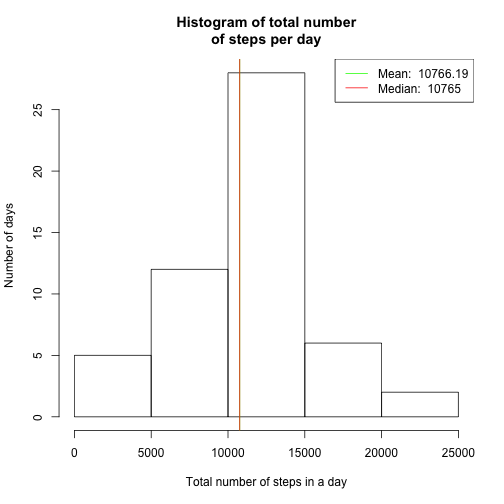
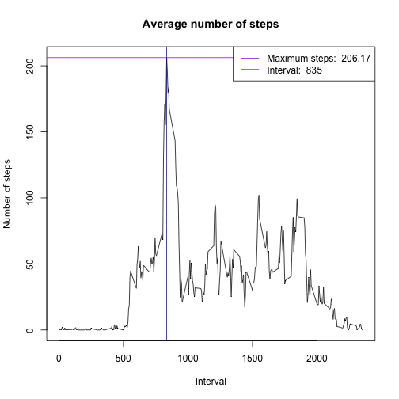

## Loading and preprocessing the data

Show any code that is needed to

* Load the data (i.e. read.csv())

Conditionally download the zip file (it also exists in the repo), and then conditionally unzip the file. The zip contains a single activity.csv file which is the data set we will be working with.


```r
# Conditionally download and unzip the data file required
if(!file.exists("activity.zip")) {
    download.file("https://d396qusza40orc.cloudfront.net/repdata%2Fdata%2Factivity.zip","activity.zip", "curl")
}
if(!file.exists("activity.csv")) {
    unzip("activity.zip")
}
##Load the data (i.e. read.csv())
rawactivity<-read.csv("activity.csv")

# once we read in the raw data, we won't need it again
unlink("activity.csv")
```

* Process/transform the data (if necessary) into a format suitable for your analysis

The description of the dataset from the course website is as follows:

The variables included in this dataset are:

* steps: Number of steps taking in a 5-minute interval (missing values are coded as NA)

* date: The date on which the measurement was taken in YYYY-MM-DD format

* interval: Identifier for the 5-minute interval in which measurement was taken

The dataset is stored in a comma-separated-value (CSV) file and there are a total of 17,568 observations in this dataset.

The read.csv function will load the dates into the table as character strings, we want to convert those to dates. 


```r
##Process/transform the data (if necessary) into a format suitable for your analysis
# convert 'date' from charater type to date type
activity<-rawactivity
activity$date<-as.Date(activity$date)
```

We can examine the data and verify that it is now ready for analysis.


```r
str(activity)
```

```
## 'data.frame':	17568 obs. of  3 variables:
##  $ steps   : int  NA NA NA NA NA NA NA NA NA NA ...
##  $ date    : Date, format: "2012-10-01" "2012-10-01" ...
##  $ interval: int  0 5 10 15 20 25 30 35 40 45 ...
```

## What is mean total number of steps taken per day?

For this part of the assignment, you can ignore the missing values in the dataset.

First we'll strip out the missing values from the dataset. And then take a sum over all observations for each date.


```r
# For this part of the assignment, you can ignore the missing values in the dataset.
activity<-na.omit(activity)
# Use aggragate to sum over the number of steps for each date, omitting incomplete observations
stepsbydate <- aggregate(steps ~ date, activity, sum)
```

Now, just verify that the resulting summary looks correct.


```r
str(stepsbydate)
```

```
## 'data.frame':	53 obs. of  2 variables:
##  $ date : Date, format: "2012-10-02" "2012-10-03" ...
##  $ steps: int  126 11352 12116 13294 15420 11015 12811 9900 10304 17382 ...
```

* Make a histogram of the total number of steps taken each day


```r
##Make a histogram of the total number of steps taken each day
hist(stepsbydate$steps, main="Histogram of total number\nof steps per day", 
     xlab="Total number of steps in a day", ylab="Number of days")
```

 

* Calculate and report the mean and median total number of steps taken per day


```r
##Calculate and report the mean and median total number of steps taken per day
mean(stepsbydate$steps)
```

```
## [1] 10766.19
```

```r
median(stepsbydate$steps)
```

```
## [1] 10765
```

The mean and median total number of steps taken per day are 10766.19 and 10765 steps respectively.

We can add these values to the histogram for visual confirmation that they make sense. However, at the resolution of the histogram the lines are on top of each other.


```r
# redraw the histogram
hist(stepsbydate$steps, main="Histogram of total number\nof steps per day", 
     xlab="Total number of steps in a day", ylab="Number of days")

# place vertical lines for mean and median on histogram
mean_val=mean(stepsbydate$steps)
median_val=median(stepsbydate$steps)
abline(v=mean_val, col = "green")
abline(v=median_val, col = "red")

# create legend
legend('topright', lty=1,col = c("green", "red"),
legend = c(paste('Mean: ', round(mean_val,digits=2)), paste('Median: ', median_val))
)
```

 


```r
# free memory of objects no longer required
rm(stepsbydate, mean_val, median_val)
```

## What is the average daily activity pattern?

* Make a time series plot (i.e. type = "l") of the 5-minute interval (x-axis) and the average number of steps taken, averaged across all days (y-axis)


```r
stepsbyinterval <- aggregate(steps ~ interval, activity, mean)
```


```r
##Make a time series plot (i.e. type = "l") of the 5-minute interval (x-axis) and the average number of steps taken, averaged across all days (y-axis)
plot(stepsbyinterval$interval, stepsbyinterval$steps, type = "l", main="Average number of steps", 
     xlab="Interval", ylab="Number of steps")
```

 

* Which 5-minute interval, on average across all the days in the dataset, contains the maximum number of steps?


```r
# Which 5-minute interval, on average across all the days in the dataset, contains the maximum number of steps?
stepsbyinterval[which.max(stepsbyinterval$steps),]
```

```
##     interval    steps
## 104      835 206.1698
```

The 104th 5-minute interval, starting at '835' of the day (08:35) has the maximum nuber of steps (206.17)

To highlight that result, add it as crosslines on the graph.


```r
##Make a time series plot (i.e. type = "l") of the 5-minute interval (x-axis) and the average number of steps taken, averaged across all days (y-axis)
plot(stepsbyinterval$interval, stepsbyinterval$steps, type = "l", main="Average number of steps", 
     xlab="Interval", ylab="Number of steps")
# Which 5-minute interval, on average across all the days in the dataset, contains the maximum number of steps?
max_interval=stepsbyinterval[which.max(stepsbyinterval$steps),]
# place vertical lines for mean and median on histogram
abline(h=max_interval$steps, col = "purple")
abline(v=max_interval$interval, col = "blue")

# create legend to say what the line represents
legend('topright', lty=1, col = c("purple","blue"),
legend = c(paste('Maximum steps: ', round(max_interval$steps,digits=2)),paste('Interval: ', round(max_interval$interval,digits=2)))
)
```

 


```r
# free memory of objects no longer required
rm(stepsbyinterval)
rm(activity)
rm(max_interval)
```

## Imputing missing values

Note that there are a number of days/intervals where there are missing values (coded as NA). The presence of missing days may introduce bias into some
calculations or summaries of the data.

* Calculate and report the total number of missing values in the dataset
(i.e. the total number of rows with NAs)


```r
sum(!complete.cases(rawactivity))
```

```
## [1] 2304
```

* Devise a strategy for filling in all of the missing values in the dataset. The strategy does not need to be sophisticated. For example, you could use the mean/median for that day, or the mean for that 5-minute interval, etc.

We will be imputing the missing data by setting the value to the average of actual values near it. For example, if a single value is NA, we will average the values directly before and after it, if multiple NAs occur in sequence, the entire sequence will be replaced with the average of the real values directly before and after it. In the case where the NAs occur at the beginning or end of the dataset, the single value directly after or before them (respectively, will be used.)

* Create a new dataset that is equal to the original dataset but with the missing data filled in.


```r
# make a copy of the original dataset, and also convert the date
activity<-rawactivity
activity$date<-as.Date(activity$date)

# fill in the missing values by averaging those around it 
for (i in 1:nrow(activity)){
    if(is.na(activity$steps[i])){
        #if this is the first interval, use the value of the first that is not na
        j<-i+1
        while (j<=nrow(activity) && is.na(activity$steps[j])) {j<-j+1}
        # we're assuming we have at least one that is not NA 
        # otherwise we're going to use the average of two NAs
        if (i == 1) {
            # actually, we could take the one at the average from the other end of the day
            interpolation=activity$steps[j]
        } else if (j > nrow(activity)) {
            # actually, we could take the one at the average from the other end of the day
            interpolation=activity$steps[i-1]
        } else {
            interpolation=(activity$steps[j]+activity$steps[i-1])/2
        }
        # if there are multiple na's we should set them all equal
        # might as well fill them all in while we're here
        activity$steps[i:j-1]=interpolation
        print(paste("NAs in rows",i,":",j-1," (",(j-i)*5/60,"hours long ) have been set to",interpolation))
    }
}
```

```
## [1] "NAs in rows 1 : 288  ( 24 hours long ) have been set to 0"
## [1] "NAs in rows 2017 : 2304  ( 24 hours long ) have been set to 0"
## [1] "NAs in rows 8929 : 9216  ( 24 hours long ) have been set to 0"
## [1] "NAs in rows 9793 : 10080  ( 24 hours long ) have been set to 0"
## [1] "NAs in rows 11233 : 11808  ( 48 hours long ) have been set to 0"
## [1] "NAs in rows 12673 : 12960  ( 24 hours long ) have been set to 0"
## [1] "NAs in rows 17281 : 17568  ( 24 hours long ) have been set to 0"
```

```r
# clean up
rm (i,j,interpolation)
```

Examining the raw activity data that is being imputed, we see that the several long NA intervals (each being one or two full days) are all bounded by intervals with zero steps. Thus all the NAs are actually set to zero. Since NAs occur in full day sequences, it may have made more sense to substitue the value for each NA interval with the average value for that interval from all other days. However, this might skew the results when trying to compare weekdays to weekends later: a weekend day should potentialy be replaced with the average for other weekend days, etc. Then again, if there are more weekend days with NAs than weekday days, then the average for weekend days will be drawn down in response, or vice versa. Since there are full days of missing data, it actually makes more sense to simply omit them from the analysis as we did in the first step.

* Make a histogram of the total number of steps taken each day and Calculate and report the mean and median total number of steps taken per day. Do these values differ from the estimates from the first part of the assignment? What is the impact of imputing missing data on the estimates of the total daily number of steps?


```r
##Process/transform the data (if necessary) into a format suitable for your analysis
###Use aggragate to sum over the number of steps for each date, note that there will be no omitted observations
stepsbydate <- aggregate(steps ~ date, activity, sum)
```


```r
##Make a histogram of the total number of steps taken each day
hist(stepsbydate$steps, main="Histogram of total (imputed) number\nof steps per day", 
     xlab="Total number of steps in a day", ylab="Number of days")
```

 


```r
##Calculate and report the mean and median total number of steps taken per day
mean(stepsbydate$steps)
```

```
## [1] 9354.23
```

```r
median(stepsbydate$steps)
```

```
## [1] 10395
```

To highlight the difference between these values and those above, add them to the current histogram, as we did above.


```r
# redraw the histogram
hist(stepsbydate$steps, main="Histogram of total number\nof steps per day", 
     xlab="Total number of steps in a day", ylab="Number of days")

# place vertical lines for mean and median on histogram
mean_val=mean(stepsbydate$steps)
median_val=median(stepsbydate$steps)
abline(v=mean_val, col = "green")
abline(v=median_val, col = "red")

# create legend
legend('topright', lty=1,col = c("green", "red"),
legend = c(paste('Mean: ', round(mean_val,digits=2)), paste('Median: ', median_val))
)
```

 

```r
# free memory of objects no longer required
rm(stepsbydate, mean_val, median_val)
```

The histogram is significantly changed, with a much larger frequency of days in the 0-5000 step range. The mean and median values have separated and both differ significantly from the estimates from the first part of the assignment. The mean has shifted further down than the median has. 

The impact of imputing missing data using the method I chose causes all of the estimates to be significantly lower.

## Are there differences in activity patterns between weekdays and weekends?

For this part the weekdays() function may be of some help here. Use the dataset with the filled-in missing values for this part.

* Create a new factor variable in the dataset with two levels – “weekday” and “weekend” indicating whether a given date is a weekday or weekend day.


```r
# the date column is actually string data and we need to convert it to date to use weekdays()
# then we need to convert the "weekday"/"weekend" strings back into factors
activity$day<-as.factor(ifelse(weekdays(activity$date) == "Sunday" | weekdays(activity$date) == "Saturday","weekend", "weekday"))
```

Verify that the modified dataset is as expected, with a 2-factor 'day' column.


```r
str(activity)
```

```
## 'data.frame':	17568 obs. of  4 variables:
##  $ steps   : num  0 0 0 0 0 0 0 0 0 0 ...
##  $ date    : Date, format: "2012-10-01" "2012-10-01" ...
##  $ interval: int  0 5 10 15 20 25 30 35 40 45 ...
##  $ day     : Factor w/ 2 levels "weekday","weekend": 1 1 1 1 1 1 1 1 1 1 ...
```

* Make a panel plot containing a time series plot (i.e. type = "l") of the 5-minute interval (x-axis) and the average number of steps taken, averaged across all weekday days or weekend days (y-axis). 


```r
# aggregate steps as interval to get average number of steps in an interval across day types
stepsbyintervalandday <- aggregate(steps ~ interval+day, activity, mean)

# ggplot and qplot are easy to use
# conditional install and load the package
if (! "ggplot2" %in% rownames(installed.packages())) install.packages("ggplot2")
library(ggplot2)

# create two plots in a single column - using the day type as a facet
qplot(interval, steps, data=stepsbyintervalandday, geom=c("line"), xlab="Interval", 
      ylab="Number of steps", main="") + facet_wrap(~ day, ncol=1)
```

 

```r
# cleanup
rm(activity)
rm(stepsbyintervalandday)
```

The plot shows that there is significantly more activity early in the day on the weekday, and significantly more in the middle of the day on the weekend. However, as mentioned above, using the 'imputed' data may actually skew the results, and we should probably compare the graphs when the NA values are omitted instead.

We expect the shapes of the graphs to remain similar but the maximum values should change. The difference between the weekend and weekday should be closer to the real data.

So, let's go back to the raw data, omit the NAs and rerun these last two graphs.


```r
##Process/transform the data (if necessary) into a format suitable for your analysis
# convert 'date' from charater type to date type
activity<-na.omit(rawactivity)
activity$date<-as.Date(activity$date)
# the date column is actually string data and we need to convert it to date to use weekdays()
# then we need to convert the "weekday"/"weekend" strings back into factors
activity$day<-as.factor(ifelse(weekdays(activity$date) == "Sunday" | weekdays(activity$date) == "Saturday","weekend", "weekday"))
stepsbyintervalandday <- aggregate(steps ~ interval+day, activity, mean)

# conditional install and load the package
if (! "ggplot2" %in% rownames(installed.packages())) install.packages("ggplot2")
library(ggplot2)

# create two plots in a single column - using the day type as a facet
qplot(interval, steps, data=stepsbyintervalandday, geom=c("line"), xlab="Interval", 
      ylab="Number of steps", main="") + facet_wrap(~ day, ncol=1)
```

 

```r
rm(activity)
rm(stepsbyintervalandday)
```

As it turns out, the maximums of both graphs are only slightly greater, and not significantly different from the previous versions. 


```r
# final cleanup
rm(rawactivity)
```
